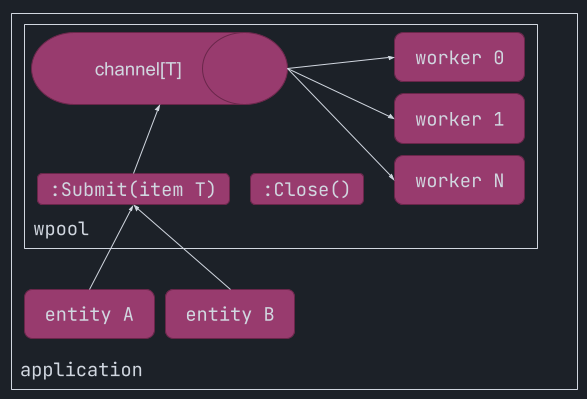

# wpool

The `wpool` module implements a bounded worker pool. It provides a safe, concurrent processing system by wrapping a channel and spawning multiple (fixed number of) workers to read from it. More specifically:

  * Generic type of the channel payload.
  * Spawns a fixed number of workers (configurable) that receive from channel and perform a configurable callback to each one.
  * The `Submit(context.Context, Item)` function lets external code enqueue items for processing.
  * Graceful shutdown when `Stop(context.Context)` is called, in steps:
    1. `Stop` blocks till all the next steps are done.
    2. Worker pool stops accepting new items, any code that performs submit after the `Stop` has been called, it will receive an error `ErrWorkerPoolStopped`.
    3. After it is ensured that no new items can be sent to the main channel, the main channel is closed.
    4. Wait for all workers go routines to finish mid-flight processing and pending items in channel and then return.
    5. Then `Stop` unblocks and finishes.

## Why and What
The `wpool` should be used when you want to have multiple senders (e.g. events from different services/sources) with graceful shutdown and/or capped worker approach over channel receiving.

### Bounded / Capped workers approach

A non-capped approach: In some cases, we can spawn a go routine for each item received from the channel. That might work well in cases where each task is small/short-lived and/or the overall number of tasks is bounded or we are sure that the system can handle the maximum concurrency.

But when the task performed for each item is not small/short-lived, or the maximum concurrency (submission of items) is not distributed smoothly over time and instead we have sudden and large bursts of submissions, then the bounded / capped worker approach is much more efficient performance wise since it will not "starve" cpu and memory resources trying to spawn (and context switch between) a large number of go routines.

### Closing channel and graceful shutdown
In go code, and more specifically in the comment of channel `close` function this is documented ([link](https://github.com/golang/go/blob/40b3c0e58a0ae8dec4684a009bf3806769e0fc41/src/builtin/builtin.go#L253-L258)):

> The close built-in function closes a channel, which must be either bidirectional or send-only. It should be executed only by the sender, never the receiver, and has the effect of shutting down the channel after the last sent value is received.

This is, in general, the principle that should be followed: the sender should close the channel.

But in some cases (let's say an application-wide event queue), we might want different code parts to be able to send events. In that case, the sender is not the sole owner of the channel, and closing the channel could lead to panic if other parts of the code (other senders) try to send to it after closing.

This solution wraps a graceful shutdown process where it first stops accepting new submissions, meaning that any attempt for submission after that point will result in returning an error. Then, closes the main channel and waits for all workers to finish processing all items already submitted to the channel (in case of buffered channel) or finish mid-flight processing. After all the workers are done and return, the stop function unblocks and finishes.
